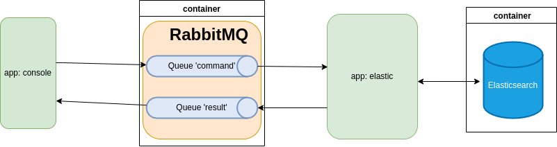
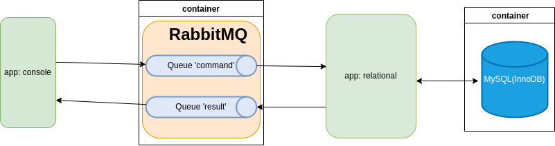

# search-engine

## Introduction

The search engine is a system for indexing | querying documents.

# Software Design

## Technology Stack

1. Java SE 11
2. RabbitMQ Java Client
3. Jackson
4. JUnit 5
5. Lombok
6. Spring boot
7. Spring boot starter amqp
8. Spring boot starter data elasticsearch
9. Spring boot starter data jdbc
10. Mysql connector java
11. Apache Maven

## FUNCTIONAL DESCRIPTION

### Overview

A search engine contains a set of documents. Each document consists of a unique ID and a list of
tokens. The search engine responds to queries by finding documents which contain certain tokens and
returning their IDs.
The program should accept a sequence of commands from standard input and respond on standard output.
Commands are terminated by newlines. There are two types of commands:

####The index command

**index** doc-id token1 … tokenN

The index command adds a document to the index. The doc-id is an integer. Tokens are arbitrary
alphanumeric strings. A document can contain an arbitrary number of tokens greater than zero. The
same token may occur more than once in a document. If the doc-id in an index command is the same as
in a previously seen index command, the previously stored document should be completely replaced (
i.e., only the tokens from the latest command should be associated with the doc-id).

**Examples** :

index 1 soup tomato cream salt
index 2 cake sugar eggs flour sugar cocoa cream butter
index 1 bread butter salt
index 3 soup fish potato salt pepper

When the program successfully processes an index command, it should output :
**index** ok doc-id

If the program sees an invalid index command (e.g, a token contains a non-alphanumeric character, or
a doc-id is not an integer) it should report an error to standard output and continue processing
commands. The error output should have the following form

**index** error error message

#### The query command

query expression

Where expression is an arbitrary expression composed of alphanumeric tokens and the special
symbols &, |, (, and ). The most simple expression is a single token, and the result of executing
this query is a list of the IDs of the documents that contain the token. More complex expressions
can be built built using the operations of set conjunction (denoted by &) and disjunction (denoted
by |). The & and | operation have equal precedence and are commutative and associative. Parentheses
have the standard meaning. Parentheses are mandatory: a | b | c is not valid, (a | b) | c must be
used (this is to make parsing queries simpler).
Logically, to execute the query the program looks at every document previously specified by the
index command, checks if the document matches the query, and outputs the doc-id if it does. However
this is suboptimal and much more efficient implementations exist.
Upon reading the query command the program should execute the query and produce the following output

**query** results doc-id1 doc-id2 …

The doc-ids of the matching documents can be output in arbitrary order. If there is an error, the
output should be

**query** error error message

**Examples**, given the index commands shown in the example above:

in: query butter
out: query results 2 1

in: query sugar
out: query results 2

in: query soup
out: query results 3

in: query (butter | potato) & salt
out: query results 1 3

### Assumptions

- Index speed is less important than query speed.

## Architecture

### Console - elastic



### Console - relational



## TO SETUP

<br>1. Install docker & docker compose locally
<br>2. From parent directory type : docker compose up -d
<br>3. Above step should download images & setup containers
<br>4. Open any mysql or sql IDE.Connect at hostname:3306 with credentials (root,password).Create
schema with sql ready at ./relational/src/main/resources/schema.sql
<br>5. Option, open rabbitmq management from browser at : http://hostname:15672 with credentials (
guest , guest)
<br>6. Option, open kibana from browser at : http://hostname:5601/app/kibana#/home?_g=()

## TO RUN

```
mvn -Dskiptests=true clean install
```

<br>First run console app (To create messaging queues on RabbitMQ).Two message queues are created :
command & result

```
java -jar ./console/target/console-1.0-SNAPSHOT.jar
```

<br>Run relational or elastic app.If both relational & elastic are running they compete for the
message on queue 'command' and only one receives the message.
If run relational app (schema must be created first on mysql-server)

```
java -jar ./relational/target/relational-1.0-SNAPSHOT.jar
or 
java -jar ./elastic/target/elastic-0.0.1-SNAPSHOT.jar
```

## API

User types commands on console.

## Security

## Authentication & authorization

#### Users of console :

| Role      | 	Authentication | Authorization	 |                                     Comment |
|-----------|:---------------:|:--------------:|--------------------------------------------:|
| Anonymous |      	None      |     	None      | No authentication & authorization for users |

<br>

#### Console app

|          | 	Authentication | Authorization	 | Comment |
|----------|:---------------:|:--------------:|--------:|
| RabbitMQ |     	Basic      |     	None      |         |

<br>

#### Elastic app

|               | 	Authentication | Authorization	 | Comment |
|---------------|:---------------:|:--------------:|--------:|
| RabbitMQ      |     	Basic      |     	None      |         |
| Elasticsearch |      Basic      |     	None      |         |

<br>

#### Relational app

|          | 	Authentication | Authorization	 | Comment |
|----------|:---------------:|:--------------:|--------:|
| RabbitMQ |     	Basic      |     	None      |         |
| MYSQL    |     	Basic      |     	None      |         |

<br>

### Logging

**console** : no logging provided.

**relational** : logging provided.

**elastic** : logging provided.

